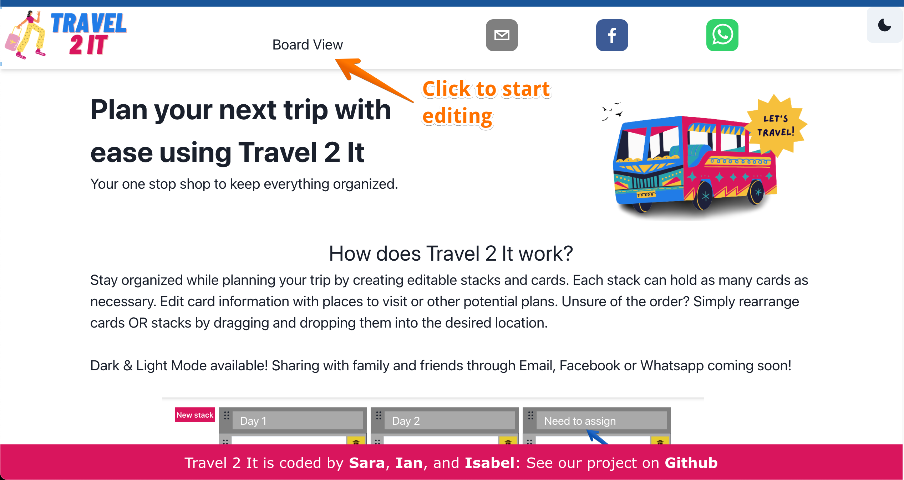
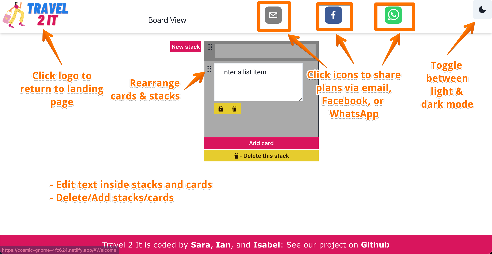
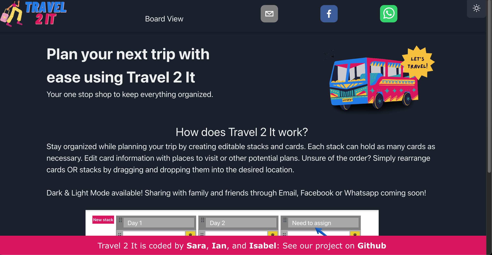
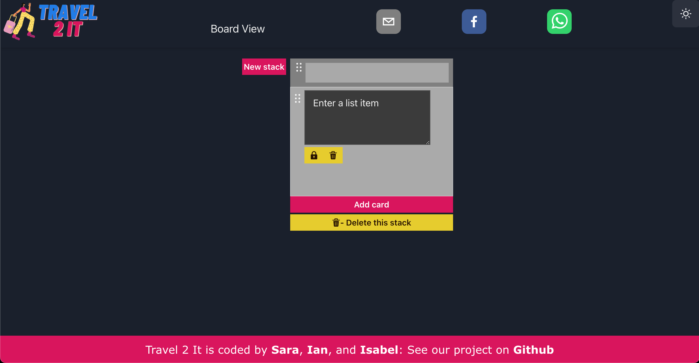

# Travel 2 It

<!--  -->

## Deployed Link
[Live Demo](https://cosmic-gnome-4fc624.netlify.app/)

## Description
Travel 2 It is a React.js travel planning app based on using editable stacks and cards as your travel agenda. This project was build as a team project for Chingu Voyage 41.

## Table of Contents
- [Installation](#Installation)  
- [Usage](#Usage)
- [How To Run](#how-to-run)
- [License](#License)
- [Contributing](#Contributing)
- [Questions](#Questions)

## Installation
- [Vite](https://vitejs.dev/)
- [Yarn](https://www.npmjs.com/package/yarn)
- [react-beautiful-dnd](https://www.npmjs.com/package/react-beautiful-dnd)
- [@chakra-ui-react](https://yarnpkg.com/package/@chakra-ui/react)
- [react-share](https://yarnpkg.com/package/react-share)

NOTE: See `package.json` for full list of app dependencies.

## Usage
The landing page will give users brief summary of Travel 2 It along with instructions for its use. Users will then click on 'Board View' to start editing their trip plans.

Users can add or remove cards and stacks. Both cards and stacks have the ability to drag and drop so they can be rearranged in any order the user desires. The user can share plans via email, Facebook or WhatsApp.

Travel 2 It allows users to toggle between light and dark mode. (dark mode pictured below)

## How to run
### Locally
1. Clone this project.
2. `cd` into the project directory.
3. Run `yarn`.
4. Run `yarn dev`.
5. Navigate to `http://127.0.0.1:5173/` in your web browser.

## License
TBD

## Contributing
[Isabel Klint](https://github.com/isabelklint)

[Ian Korpi](https://github.com/iankorpi)

[Sara Baqla](https://github.com/missatrox44) 

<!-- ## Questions
Github username: [missatrox44](https://github.com/missatrox44)  
Email: missatrox44@gmail.com -->